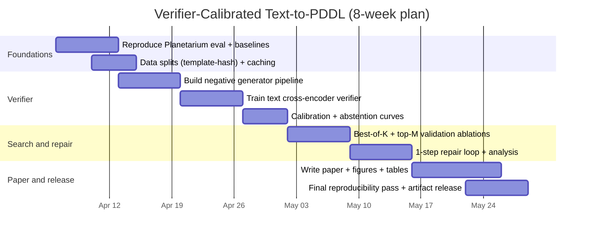

# Designing a Publishable cs.AI arXiv Project: Verifier-Calibrated Text-to-PDDL Planning

## Executive summary

Recent cs.AI work has shown that large language models can generate planning artifacts such as PDDL problem and domain files, but “looking valid” is not the same as being *semantically correct* for the described task. A key empirical finding in the **Planetarium** benchmark is that even strong models can produce PDDL that parses and is solvable, yet still fails semantic equivalence to the intended natural-language problem. citeturn8search0turn8search4turn17search1

This report proposes three publishable cs.AI project directions, then selects one as the best balance of novelty, feasibility, and publishability:

- **Candidate A (recommended): Verifier-Calibrated Search and Repair for Text-to-PDDL.** Train a *semantic verifier* on Planetarium-labeled data and use it for best-of-N selection plus lightweight repair, with explicit abstention when confidence is low. This directly targets the “valid-but-wrong” gap that Planetarium quantified. citeturn8search4turn17search1  
- **Candidate B: Causal-Structured World Models for Offline RL under Intervention Shift.** Extend FOCUS-style causal structured world models to be robust under counterfactual interventions and distribution shift, evaluated on D4RL and related offline RL suites. citeturn11search1turn13search4turn20search0turn20search4  
- **Candidate C: Interventional Faithfulness Audits for Agentic Reasoning Traces.** Operationalize causal interventions on reasoning traces to measure “faithfulness” of agent explanations, building on recent causal/faithfulness audit proposals and perturbation tests. citeturn15search0turn22search6turn21search2  

**Recommendation rationale:** Candidate A sits squarely in cs.AI (planning, representation, verification), has a strong benchmark + open infrastructure (Planetarium, Fast Downward, VAL), is implementable on modest compute, and offers a clear novelty wedge: combining verifier-guided search with *calibration/abstention* to address known verifier failure modes. citeturn17search1turn17search0turn18search0turn10search0  

## Source and landscape scan

This work began with enabled connectors: entity["company","Consensus","research api platform"] and entity["company","Hugging Face","ml model and dataset hub"], used to discover recent cs.AI planning and causal-reasoning papers and datasets (notably Planetarium, NL2Plan, FOCUS, and Project Ariadne). It then expanded via web search to primary and official sources, emphasizing repositories and maintained project sites for reproducibility (Planetarium repo + dataset card, Fast Downward repo, VAL repo, IPC/ICAPS sites). citeturn17search1turn17search0turn18search0turn16search2turn14search1  

A recurring theme across modern AI planning-with-LLMs: **formalization helps** (translate natural language into PDDL, then use classical planners), but **formalization is brittle** and evaluation must distinguish parseable/solvable artifacts from semantically faithful ones. This is explicitly discussed in NL2Plan, Planetarium, and follow-on evaluations of LLM planning performance. citeturn3search2turn8search4turn10search1turn9search3  

Also relevant is a caution from verifier-guided reasoning: imperfect verifiers can mis-rank candidates and prune valid solutions as sample size scales, motivating calibrated selection and abstention. citeturn10search0  

## Candidate project topics

### Comparison table

| Candidate | Core contribution | Novelty / impact | Difficulty | Data needs | Compute needs | Main risks |
|---|---|---|---|---|---|---|
| A: Verifier-Calibrated Text-to-PDDL | Train semantic verifier + calibrated selection/repair for PDDL problems | High practical impact; benchmarked semantic correctness | Medium | Planetarium + synthetic negatives | Low–medium | Verifier miscalibration; domain specificity |
| B: Causal world models for offline RL | Intervention-robust causal structure in offline MBRL | High scientific value in robust decision-making | High | D4RL + controlled synthetic SCM env | High | Long experimentation cycles; confounders in benchmarks |
| C: Interventional faithfulness audits | Causal intervention suite + metrics for reasoning-trace faithfulness | Timely for agent safety; meaningful metrics | Medium–high | Prompt suites + curated reasoning tasks | Medium | Hard to prove construct validity; metric gaming |

The Planetarium dataset is explicitly limited to two domains and the STRIPS subset, which shapes Candidate A’s scope and risk profile. citeturn8search4turn8search5  

### Candidate A: Verifier-Calibrated Search and Repair for Text-to-PDDL

**Concise problem statement (cs.AI):** Given a natural-language description of a planning task in a known domain, generate a PDDL problem file that is *semantically equivalent* to the described initial and goal states, not merely parseable or solvable. Planetarium shows that current LLM pipelines often fail this stronger criterion. citeturn8search4turn8search1  

**Motivation:** Classical planners provide soundness guarantees *conditional on a correct model*. The bottleneck is the NL→PDDL translation step: even small semantic slips change the task. Planetarium introduced an equivalence-based evaluation precisely because plan-validator-based checks can accept wrong problems. citeturn8search0turn17search1  

**Novelty wedge:**  
- Build a **learned semantic verifier** trained on (NL, candidate-PDDL) pairs labeled by Planetarium equivalence against ground truth.  
- Use the verifier for **best-of-N** selection and optionally **repair**.  
- Add **calibration + abstention** to reduce “verifier-induced” regression at scale, motivated by known verifier-guided scaling flaws. citeturn8search4turn10search0  

**Related work (arXiv + top venues):**  
- **Planetarium** provides equivalence-based evaluation and a large dataset of text-to-PDDL pairs; its repo includes evaluation/finetuning scaffolding and dependencies (Fast Downward, VAL). citeturn8search4turn17search1  
- **NL2Plan** shows a domain-agnostic pipeline: extract information from text, produce domain+problem PDDL, solve with a classical planner, and sometimes abstain rather than emit invalid plans. citeturn3search2turn0search4  
- **LLM-based planning domain generation** evaluates LLMs for domain-model creation and provides a framework + codebase (reported as accepted at an ICAPS edition in the repo). citeturn9search2turn17search3  
- **Consistency checking during PDDL generation** uses automated checks as feedback to improve generated domains. citeturn3search1turn3search6  
- **LLM as formalizer** studies limits of “LLM→PDDL→planner” pipelines under varying naturalness of descriptions and lexical perturbations. citeturn9search3turn9search8  
- **Test-time scaling for symbolic world model generation** explores best-of-N and iterative refinement without training to improve PDDL generation. citeturn3search0turn3search10  
- **Instruction tuning for symbolic planning (PDDL-Instruct)** indicates that targeted instruction tuning can substantially improve formal planning accuracy. citeturn10search2turn10search5  

**Hypothesis:** A trained semantic verifier, calibrated for selective prediction, will significantly increase semantic correctness (equivalence) at fixed generation budget, and will reduce catastrophic failure by abstaining when confidence is low.

**Evaluation metrics:**  
- **Parseability rate** (PDDL parses)  
- **Validity/solvability rate** (planner can solve; optionally validate with VAL) citeturn18search0turn1search2  
- **Semantic correctness** (Planetarium equivalence score / binary equivalence) citeturn17search1turn8search4  
- **Cost/length of derived plans** when applicable (secondary metric; depends on planners) citeturn1search2turn17search0  
- **Selective risk-coverage curve** (accuracy vs. fraction answered) for calibrated abstention (a standard evaluation pattern for selective prediction; you can report ECE-like calibration too as auxiliary).

**Datasets:**  
- Primary: **Planetarium** (HF dataset card specifies templates, multiple description styles, and limitations; GitHub repo provides code and equivalence algorithm). citeturn8search4turn17search1  
- Extensions (optional but publishable): add 2–4 more STRIPS domains (e.g., IPC classical domains) by implementing the “fully specified” oracle components for equivalence checking; Planetarium repo documents adding domains. citeturn17search1turn16search0  

**Baselines:**  
- Single-shot prompting (greedy)  
- Best-of-N sampling (N ∈ {4, 8, 16, 32})  
- Test-time refinement strategies inspired by VML-style pipelines citeturn3search0turn3search10  
- NL2Plan-style decomposition (if you restrict to its problem formalization step) citeturn3search2  
- “Planner-valid” filtering only (parse + solvable + VAL) versus equivalence-based selection citeturn18search0turn17search1  

**Expected results (directional, to be validated):**  
- Material lift in **semantic correctness** compared with solvability-only filtering, aligning with Planetarium’s finding that validity is a weak proxy for semantic correctness. citeturn8search0turn8search4  
- Improved robustness on “more natural” text styles where formalization tends to degrade. citeturn9search3  
- Better reliability at higher N due to calibration/abstention reducing verifier-induced collapses described in general verifier-guided scaling studies. citeturn10search0  

### Candidate B: Intervention-Robust Causal-Structured World Models for Offline RL

**Concise problem statement (cs.AI):** Offline RL learns policies from static logs, but learned world models can encode spurious dependencies from logged behavior. Causal-structured world models aim to represent environment dynamics in a way that generalizes under interventions and distribution shift. citeturn11search1turn13search4  

**Motivation:** Offline RL is attractive in safety-critical domains where exploration is expensive or dangerous; benchmarks like D4RL were created to standardize evaluation across heterogeneous offline datasets. citeturn11search0turn13search4  

**Related work:**  
- **FOCUS** explicitly targets causal structure in offline model-based RL and argues for generalization benefits from causal world models. citeturn11search1turn12search4  
- **D4RL** provides offline RL tasks/datasets and a community evaluation substrate (paper + repo ecosystem and blog explanation). citeturn11search0turn13search4turn13search2  
- Strong offline RL baselines include **IQL**, **CQL**, and model-based approaches like **MOPO**. citeturn20search0turn20search4turn20search8  

**Hypothesis:** Adding explicit causal-structure regularization plus intervention-based stress tests will improve out-of-distribution policy performance relative to non-causal model-based offline RL, especially under targeted intervention shift.

**Evaluation metrics:** normalized return on D4RL; OOD robustness under synthetic interventions; uncertainty calibration of dynamics predictions; policy constraint violations.

**Datasets:** D4RL suites; plus a synthetic SCM environment generator to create controlled intervention splits.

**Baselines:** IQL, CQL, MOPO; FOCUS; standard model-based ensembles.

**Expected results:** moderate gains on OOD splits; clearer attribution of failures to mistaken causal edges vs. function approximation.

**Risks:** Significant engineering/compute; the causal discovery component can be unstable; benchmarking causality claims is notoriously tricky.

### Candidate C: Interventional Faithfulness Auditing of Agent Reasoning Traces

**Concise problem statement (cs.AI):** Agentic LLM systems output reasoning traces (e.g., chain-of-thought), but evidence suggests these traces can be post-hoc rationalizations rather than causal drivers of decisions. We need *auditing methods* that quantify causal dependence of outputs on intermediate reasoning. citeturn15search0turn22search6  

**Motivation:** As agents are used for higher-stakes autonomous decision-making, interpretability demands move from “plausible explanations” to “faithful causal explanations.” citeturn15search0turn15search5  

**Related work:**  
- **Measuring Faithfulness in CoT** proposes perturbation-based tests (e.g., adding mistakes, paraphrases) to assess reliance on CoT. citeturn22search6turn22search4  
- **Faithful CoT** decomposes into translation + deterministic solving to ensure faithfulness-by-construction (not always applicable but conceptually important). citeturn22search0turn22search5  
- **Project Ariadne** proposes SCM-based hard interventions and metrics like “faithfulness gap”/causal decoupling for agentic reasoning audits. citeturn15search0turn15search5  
- Mechanistic studies attempt feature-level causal analysis of CoT behavior under interventions. citeturn21search2turn21search5  

**Hypothesis:** A standardized intervention suite that combines perturbation tests + SCM-style do-interventions will better predict real-world “reasoning trace trustworthiness” than text-similarity-based interpretability measures.

**Evaluation metrics:** causal sensitivity of answer to trace interventions; task accuracy; intervention consistency; false-positive/false-negative rates on known faithful-by-construction pipelines.

**Datasets:** curated reasoning tasks (math, planning, QA); plus synthetic counterfactual tasks from executable frameworks. citeturn15search2turn15search3  

**Baselines:** perturbation-only tests (CoT faithfulness), faithful-by-construction pipelines, Ariadne-style interventions.

**Risks:** Construct validity (what does “faithful” operationally mean?), and risk of optimizing to the audit.

## Selected project design and experiments

**Chosen candidate:** Candidate A — Verifier-Calibrated Search and Repair for Text-to-PDDL.

### Core idea

1. **Generate** K candidate PDDL problems from a base instruction-tuned model (prompt-only) or a lightly tuned model.  
2. **Filter** by syntax (parse) and optionally by planning validity (Fast Downward) and plan validation (VAL). citeturn17search0turn18search0  
3. **Score** each candidate with a **semantic verifier** trained to predict equivalence-to-intent (supervised labels from Planetarium equivalence vs. ground truth). citeturn17search1turn8search4  
4. **Select** argmax score, but only if calibrated confidence ≥ τ; otherwise **abstain** or trigger **repair** (one or more edit iterations).  
5. **Evaluate** on held-out Planetarium splits using equivalence, plus parse/validity rates.

This is explicitly designed to beat solvability-only filtering, which Planetarium shows can dramatically overestimate correctness. citeturn8search0turn8search4  

### Experimental conditions and ablations

**Main factors to vary:**
- Sampling budget K ∈ {1, 4, 8, 16, 32}  
- Verifier type:
  - Text cross-encoder (NL + PDDL → scalar)
  - Graph-text verifier (PDDL parsed to scene graph features + NL encoder; fuse and score)
- Calibration method: temperature scaling vs. simple held-out isotonic; plus abstention threshold τ
- Repair: none vs. 1-step vs. 2-step “edit prompts” guided by verifier explanation

**Failure-mode targeted splits:** Planetarium provides multiple description styles (explicit/abstract/mixed), which you should report separately, because stylistic naturalness affects formalization quality. citeturn8search4turn8search5  

### Model architecture details

**Generator (baseline):**
- Use an open-weight instruction model (7B-class is typical) with prompt templates that force:
  - strict PDDL formatting
  - explicit object list extraction
  - initial state predicates list
  - goals list
- Add self-consistency style prompting (multiple independent samples) and constrain output to code blocks for parsing.

**Optional generator finetune (if you want stronger novelty):**
- LoRA-based supervised finetuning on (NL → gold PDDL) pairs, possibly with QLoRA to fit limited GPU memory. citeturn19search0turn19search1turn19search8  

**Verifier (recommended baseline):**
- Transformer cross-encoder classifier. Input is concatenated:
  - `[CLS] NL_DESCRIPTION [SEP] PDDL_CANDIDATE [SEP]`
- Output: `p_hat = sigmoid(w^T h_cls)` interpreted as “probability of semantic correctness.”
- Train on:
  - Positive: (NL, gold PDDL)  
  - Hard negatives: (NL, perturbed gold PDDL) + (NL, LLM-generated invalid-but-parseable PDDL)
- For hard negatives, use domain-aware perturbations: swap objects, negate goals, drop predicate, wrong arity, wrong object typing.

**Verifier calibration + abstention:**
- Fit calibration on validation set; choose τ maximizing expected utility (accuracy–abstention tradeoff).
- Motivation: verifier-guided search can underperform at scale due to misranking and pruning of valid solutions; calibration is a concrete mitigation. citeturn10search0  

### Datasets and splits

**Primary dataset:** Planetarium on entity["company","GitHub","code hosting platform"] and on the entity["company","Hugging Face","ml model and dataset hub"] datasets hub. It provides multiple NL descriptions per PDDL instance and documents current limitations (only Blocks World + Gripper; STRIPS subset). citeturn17search1turn8search4turn8search5  

**Proposed splitting strategy (paper-friendly):**
- Hold out by **problem template seed** to avoid leakage (not just random row shuffles).
- Report by domain and description style.

### Baselines to implement

- **Greedy prompting** (K=1)  
- **Best-of-K** by:
  - random selection among valid/solvable
  - planner-validity filtering only
  - semantic verifier ranking (yours)
- **System baselines** where feasible:
  - NL2Plan-style decomposition (if you can replicate on Planetarium’s domains) citeturn3search2  
  - Planetarium repo’s provided finetuning/evaluation routines as reference implementation points citeturn17search1  
  - Compare to reported outcomes on Planetarium card/paper (semantic correctness gap) citeturn8search0turn8search4  

### Training hyperparameters

**Verifier (text cross-encoder):**
- Optimizer: AdamW  
- LR: 2e-5 (sweep {1e-5, 2e-5, 5e-5})  
- Batch: 16–64 (gradient accumulation if needed)  
- Max seq len: 512 (try 768 if you see truncation)  
- Epochs: 1–3 with early stopping on equivalence-AUC proxy  
- Regularization: dropout 0.1, weight decay 0.01  

**Generator LoRA finetune (optional):**
- LoRA rank r ∈ {8, 16}; α = 16–32; target modules = attention proj + MLP proj  
- LR: 2e-4; warmup 3%; cosine decay  
- Seq len: 1024 (PDDL can be long)  
- Epochs: 1 (start) + optional 2nd on hard examples  
- Use QLoRA-style 4-bit if GPU memory limited. citeturn19search1turn19search8  

### Compute and storage estimates

These are conservative planning estimates for budgeting (actual depends on hardware, sequence length, and framework throughput).

- **Data storage:** Planetarium dataset is ~68 MB in files and ~584k rows; processed caches/logs can reach 2–10 GB depending on caching and generated candidates. citeturn8search4  
- **Verifier training:** 1×A100-class GPU, ~3–10 hours for 1–3 epochs at 512 tokens (plus 10–30 hours for hyperparameter sweeps).  
- **Generation + evaluation:** If K=16 and you evaluate 50k test instances, you may generate ~800k candidates; runtime is dominated by model inference and (optional) planning validation. If you use Fast Downward per candidate, you will likely need to sharply reduce planner calls (e.g., only run planner on top-M candidates). citeturn17search0turn1search2  

### Code structure proposal

A paper-friendly repository layout that supports clean ablations:

- `data/` loaders, caching, split definitions  
- `pddl/` parsing, normalization, domain-specific utilities  
- `generation/` prompts, sampling, constrained decoding wrappers  
- `verifier/` model + training + calibration  
- `search/` best-of-K selection, abstention, repair loop  
- `eval/` Planetarium equivalence wrapper, planner/VAL hooks, metrics  
- `configs/` YAML experiment configs  
- `scripts/` one-command reproduce scripts  
- `results/` saved metrics + tables + plots + artifacts

### Reproducibility checklist

- Pin dataset version + commit hash for Planetarium code and dataset card. citeturn17search1turn8search4  
- Pin planner versions: Fast Downward + VAL; document install paths and command lines. citeturn17search0turn18search0  
- Fixed random seeds for sampling, training init, dataloader shuffles  
- Record: prompt templates, decoding params (temperature/top-p), K, abstention τ  
- Log all experiment configs and store predictions for test set (so reviewers can recompute metrics)  
- Report per-split metrics (domain × text style)  

### Failure modes and mitigations

- **Verifier-induced misranking:** Known issue in verifier-guided search at scale; mitigate with calibration, diversity sampling, and “top-M then validate” rather than pure pruning. citeturn10search0  
- **Domain leakage:** Avoid random row split; split by underlying PDDL instance/template families. citeturn8search4  
- **Overfitting to Planetarium’s domains:** Extend to additional STRIPS domains if time permits; Planetarium repo supports adding domains but requires oracle work. citeturn17search1  
- **Planner/validator bottlenecks:** Use planner calls sparingly; VAL and Fast Downward are useful but can be expensive at scale. citeturn18search0turn1search2  

## Paper package

### Suggested titles

- “Verifier-Calibrated Search and Abstention for Faithful Text-to-PDDL Translation”
- “Beyond Solvable: Calibrated Semantic Verification for Natural-Language Planning Formalization”
- “PlanVeriCal: Calibrated Verifier-Guided Generation for Semantic-Correct PDDL Problems”

### Ready-to-use outline

1. Introduction (problem, why solvable ≠ correct, contributions)  
2. Background (PDDL, planners, Planetarium equivalence evaluation) citeturn12search3turn17search1  
3. Related work (LLM planning formalization, evaluation, verifier-guided search, calibration) citeturn3search2turn10search0turn9search3turn8search4  
4. Method (candidate generation, semantic verifier, calibration/abstention, repair loop)  
5. Experimental setup (datasets, splits, baselines, metrics, implementation)  
6. Results (aggregate + per-style, ablations, scaling with K, selective risk-coverage)  
7. Analysis (error taxonomy; verifier failures; compute tradeoffs)  
8. Limitations, ethics, future work  
9. Conclusion  

### Abstract (≈300 words)

Natural-language interfaces to automated planning promise to make planning systems accessible without requiring users to author Planning Domain Definition Language (PDDL) artifacts. However, recent benchmarks show that strong language models frequently generate PDDL problems that are syntactically valid and even solvable by classical planners, yet semantically misrepresent the intended task. This “valid-but-wrong” failure mode is particularly problematic in downstream agents where planning correctness depends on faithful formalization. We propose **Verifier-Calibrated Search and Repair (VCSR)**, a practical framework for faithful text-to-PDDL translation that combines (i) budgeted candidate generation, (ii) a learned semantic verifier trained to predict task-faithfulness, and (iii) calibrated abstention to control the risk of selecting semantically incorrect outputs. VCSR trains the verifier on automatically labeled supervision derived from the Planetarium benchmark’s equivalence-based evaluation: positive pairs consist of natural-language descriptions matched with ground-truth PDDL, while hard negatives are constructed from model-generated candidates and targeted perturbations of gold problems. At inference time, VCSR samples K candidates, applies lightweight syntactic and planning-validity filters, and ranks remaining candidates via the verifier. Importantly, we calibrate verifier scores on a held-out validation set and allow the system to abstain or trigger a constrained repair step when confidence is low, mitigating known scaling failures of verifier-guided search. We evaluate on Planetarium’s multiple description styles and report parseability, planning validity, and semantic equivalence. Across K ∈ {1, 4, 8, 16, 32}, VCSR substantially improves semantic correctness over prompting and solvability-only filtering while providing predictable risk-coverage tradeoffs through abstention. Our results suggest that calibrated semantic verification is a simple, effective ingredient for trustworthy planning formalization, and offers a path toward extending language-to-planning pipelines beyond “solved” toward “faithfully solved.” citeturn8search4turn17search1turn10search0  

### Methods draft (target: ~1 page)

**Task.** We consider text-to-PDDL problem translation in fixed STRIPS domains. Input is a natural-language description specifying objects, initial state, and goal conditions. Output is a PDDL problem file. A translation is correct if it is semantically equivalent to the ground-truth PDDL instance for that description, not merely parseable or solvable by a planner. The motivation follows Planetarium’s observation that planning validators and solvability checks can accept semantically incorrect problems. citeturn8search4turn17search1  

**Candidate generation.** Given an input description \(x\), a base instruction-tuned language model \(G\) produces a set of \(K\) candidate PDDL problems \(\{y_k\}_{k=1}^K\) via stochastic decoding (temperature/top-p). Prompts enforce strict formatting constraints (single PDDL problem, no commentary). We optionally apply a syntactic parser and discard unparsable outputs. For candidates that parse, we may further apply classical planning and/or plan validation as weak filters: we run Fast Downward to test solvability and optionally validate returned plans with VAL. These checks are intentionally treated as *necessary but insufficient* signals, since semantic mismatch can persist even when solvable. citeturn17search0turn18search0turn8search4  

**Semantic verifier training.** We train a binary classifier \(V_\theta(x, y) \in [0,1]\) to predict whether candidate PDDL \(y\) faithfully matches description \(x\). Supervision is derived automatically using Planetarium’s equivalence procedure, which maps PDDL problems to structured graph representations and tests equivalence via isomorphism after domain-specific “fully specified” completion. For each gold (description, PDDL) pair \((x, y^\*)\), we create positives \((x, y^\*)\). Negatives are of two types: (i) model-generated candidates \(y_k\) labeled by equivalence against \(y^\*\), and (ii) hard perturbations of \(y^\*\) (e.g., swapped objects in goals, dropped predicates) that remain parseable. This yields a dataset of (x, y, label) triples with strong semantic signal. citeturn17search1turn8search4  

**Verifier-guided selection.** At inference, among surviving candidates we choose \(\hat{y}=\arg\max_y V_\theta(x,y)\). To reduce failure from verifier misranking, we calibrate verifier scores on a held-out validation set (temperature scaling or isotonic regression) and adopt selective prediction: if \( \max_y \tilde{V}(x,y) < \tau \), the system abstains (returns “cannot confidently formalize”) or triggers one repair iteration by prompting the generator to minimally edit the best candidate to increase verifier score while preserving syntax. This design addresses known scaling flaws in verifier-guided search where imperfect verifiers can prune valid solutions as sample size grows. citeturn10search0  

**Evaluation.** We report (1) parseability, (2) planning validity/solvability, and (3) semantic correctness via Planetarium equivalence on test splits stratified by domain and description style. We additionally report risk-coverage curves induced by varying \(\tau\). citeturn8search4turn17search1  

## Reproducible implementation plan

### Workflow diagram

```mermaid
flowchart TD
  A[Planetarium dataset\n(NL, gold PDDL)] --> B[Split by template/instance family]
  B --> C[Train/Val/Test]

  C --> D[Generate K candidates per NL\n(prompted LLM)]
  D --> E[Parse filter\n(PDDL parser)]
  E --> F[Optional: planner filter\nFast Downward + VAL]
  F --> G[Semantic verifier V(x,y)\n(train on equivalence labels)]
  G --> H[Calibrate verifier scores\n(val set)]
  H --> I[Select best candidate]
  I --> J{score >= tau?}
  J -->|yes| K[Return PDDL]
  J -->|no| L[Abstain OR Repair loop]
  L --> D

  K --> M[Evaluate on test\nparse/valid/equivalence]
  L --> M
```

The evaluation step relies on Planetarium’s equivalence mechanism and may optionally include classical planning tools depending on the ablation. citeturn17search1turn18search0turn17search0  

### Minimal data preprocessing steps

1. Load Planetarium from the datasets hub. citeturn8search4  
2. Normalize text:
   - strip leading/trailing whitespace
   - preserve punctuation and casing (PDDL is case-sensitive in some toolchains)
3. Normalize PDDL:
   - ensure balanced parentheses
   - canonicalize whitespace
4. Create splits:
   - group rows by underlying ground-truth PDDL identity (template id / hash of normalized gold PDDL)
   - split groups into train/val/test (e.g., 80/10/10)
5. Construct verifier examples:
   - positives: (NL, gold PDDL)
   - negatives:
     - LLM-generated candidates labeled by equivalence
     - perturbations of gold PDDL (programmatic edits)

### Pseudocode (core training + inference)

```python
# Pseudocode: Verifier-Calibrated Search and Repair (VCSR)

def build_splits(rows):
    groups = group_by(rows, key=lambda r: hash(normalize_pddl(r.gold_pddl)))
    return split_groups(groups, ratios=(0.8, 0.1, 0.1), seed=0)

def label_equivalence(nl, cand_pddl, gold_pddl, planetarium_oracle):
    # returns 1 if equivalent, else 0
    return int(planetarium_oracle.is_equivalent(cand_pddl, gold_pddl))

def make_verifier_dataset(train_rows, generator, planetarium_oracle, K_neg=4):
    dataset = []
    for r in train_rows:
        x = r.natural_language
        y_star = r.gold_pddl
        dataset.append((x, y_star, 1))

        # hard negatives from model samples
        samples = generator.sample_pddl(x, k=K_neg, temperature=0.8, top_p=0.95)
        for y in samples:
            if parses(y):
                label = label_equivalence(x, y, y_star, planetarium_oracle)
                if label == 0:
                    dataset.append((x, y, 0))

        # programmatic perturbations (domain-aware)
        for y_bad in perturb_pddl(y_star, n=2):
            if parses(y_bad):
                dataset.append((x, y_bad, 0))
    return dataset

def train_verifier(verifier, train_data, val_data):
    verifier.fit(train_data, val_data)  # standard BCE training
    verifier.calibrate(val_data)        # temperature/isotonic
    return verifier

def vc_sr_infer(nl, generator, verifier, K=16, tau=0.7, max_repairs=1):
    for attempt in range(max_repairs + 1):
        cands = generator.sample_pddl(nl, k=K, temperature=0.8, top_p=0.95)
        cands = [y for y in cands if parses(y)]

        if not cands:
            return {"status": "abstain", "reason": "no_parseable_candidate"}

        scores = [verifier.score_calibrated(nl, y) for y in cands]
        best_idx = argmax(scores)
        best_y, best_s = cands[best_idx], scores[best_idx]

        if best_s >= tau:
            return {"status": "ok", "pddl": best_y, "score": best_s}

        # low confidence: run a constrained repair step
        if attempt < max_repairs:
            nl = make_repair_prompt(original_nl=nl, candidate_pddl=best_y)
        else:
            return {"status": "abstain", "reason": "low_confidence", "score": best_s}
```

The core supervision signal uses Planetarium’s equivalence evaluation rather than solvability checks alone, aligning the verifier with semantic correctness. citeturn8search4turn17search1  

### Minimal “run instructions” (template)

```bash
# 1) Create env
python -m venv .venv && source .venv/bin/activate
pip install -U pip

# 2) Install dependencies
pip install datasets transformers accelerate peft bitsandbytes evaluate
pip install networkx  # if your graph-based verifier uses it

# 3) Install Planetarium tools (for oracle/evaluation)
pip install git+https://github.com/BatsResearch/planetarium.git

# 4) (Optional but recommended) Install Fast Downward + VAL
# Fast Downward repo:
# https://github.com/aibasel/downward
# VAL repo:
# https://github.com/KCL-Planning/VAL

# 5) Train verifier
python scripts/train_verifier.py \
  --dataset BatsResearch/planetarium \
  --split_strategy template_hash \
  --neg_samples_per_pos 4 \
  --model deverta_or_similar \
  --max_len 512

# 6) Run inference & evaluation
python scripts/eval_vcsr.py \
  --dataset BatsResearch/planetarium \
  --K 16 \
  --tau 0.7 \
  --use_planner_filter false
```

Planetarium’s repository documents evaluation utilities and dependencies (including Fast Downward and VAL) and provides a reference implementation for equivalence-based assessment. citeturn17search1turn18search0turn17search0  

## Ethics, limitations, and future work

**Ethical considerations**
- **Reliability and safe abstention:** Returning an incorrect formalization can be worse than refusing; abstention with calibrated confidence is a safety feature rather than a weakness, especially if the pipeline is integrated into agents. The motivation aligns with concerns about unfaithful reasoning traces and overconfident outputs in agentic systems. citeturn15search0turn22search6  
- **Dataset scope and biases:** Planetarium focuses on two domains and STRIPS; improvements might not transfer to numeric/temporal PDDL variants without additional work. citeturn8search4turn12search8  
- **License compliance:** Planetarium repo is BSD-3-Clause; ensure you keep attribution and follow downstream licenses for planners/validators. citeturn17search1turn17search0turn18search0  

**Limitations (for Candidate A)**
- **Domain-specific equivalence:** Planetarium’s equivalence relies on domain-specific “fully specified” transformations; extending to new domains is non-trivial. citeturn17search1turn8search4  
- **Verifier brittleness:** If the verifier learns dataset artifacts, it can select “stylish” but wrong PDDL. Calibration reduces overconfidence but does not eliminate spurious ranking. citeturn10search0  
- **Planner validity ≠ semantic correctness:** Even with Fast Downward and VAL, semantic mismatch can persist; your paper should clearly separate these metrics. citeturn8search4turn1search2turn18search0  

**Future work**
- Extend to additional IPC domains and evaluate generalization using official IPC benchmarks and tooling. citeturn16search0turn14search1  
- Generalize equivalence checking beyond hand-crafted oracles (learned canonicalization or constraint-based semantics).  
- Move from “problem-only” to “domain+problem” generation, connecting to prior work on domain generation and consistency checks. citeturn9search2turn3search1  
- Incorporate parameter-efficient finetuning for generators (LoRA/QLoRA) when stronger generation is required. citeturn19search0turn19search1  

## Timeline and resource budget

### Prioritized timeline



This timeline assumes you leverage Planetarium’s existing evaluation harness and classical planning tooling where needed. citeturn17search1turn17search0turn18search0  

### Resource budget (recommended)

| Resource | Baseline plan | Stretch plan |
|---|---:|---:|
| GPU hours | 150–300 (verifier sweeps + inference) | 600–1200 (add LoRA generator finetune + more domains) |
| CPU hours | 200–600 (parsing, data prep, optional planner calls) | 1000+ (IPC-domain extension + more planner validation) |
| Storage | 20–50 GB (caches, logs, generations) | 100–300 GB (multiple K values, saved candidates, extra domains) |

Planner-heavy evaluation should be budgeted carefully; Fast Downward and VAL are valuable but can dominate runtime if invoked per candidate at large K. citeturn17search0turn18search0turn1search2  

### Key sources and links (copy/paste)

```text
Planetarium dataset (HF):
https://huggingface.co/datasets/BatsResearch/planetarium

Planetarium code:
https://github.com/BatsResearch/planetarium

Fast Downward (repo):
https://github.com/aibasel/downward

Fast Downward (official site):
https://www.fast-downward.org/latest/literature/

VAL plan validator:
https://github.com/KCL-Planning/VAL

IPC 2023 main:
https://ipc2023.github.io/

IPC 2023 classical track:
https://ipc2023-classical.github.io/

IPC 2023 learning track:
https://ipc2023-learning.github.io/

ICAPS official:
https://www.icaps-conference.org/

D4RL (installation references rail-berkeley/d4rl):
https://github.com/kpertsch/d4rl
https://bair.berkeley.edu/blog/2020/06/25/D4RL/

Project Ariadne (paper hub page):
https://huggingface.co/papers/2601.02314

Measuring Faithfulness in Chain-of-Thought Reasoning:
https://huggingface.co/papers/2307.13702

LoRA and QLoRA:
https://huggingface.co/papers/2106.09685
https://huggingface.co/papers/2305.14314
```

These links correspond to the primary implementation artifacts and paper hubs cited throughout the report. citeturn8search4turn17search1turn17search0turn18search0turn14search1turn16search2turn13search4turn15search0turn22search6turn19search0turn19search1