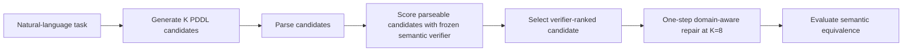
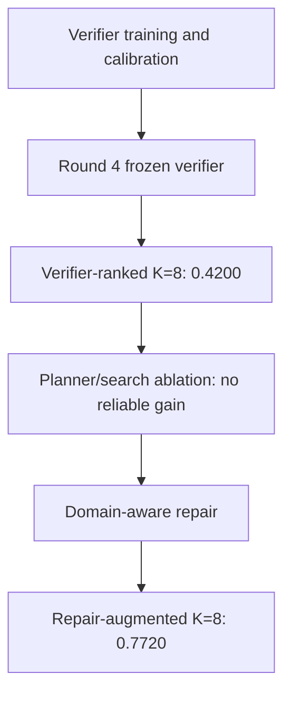
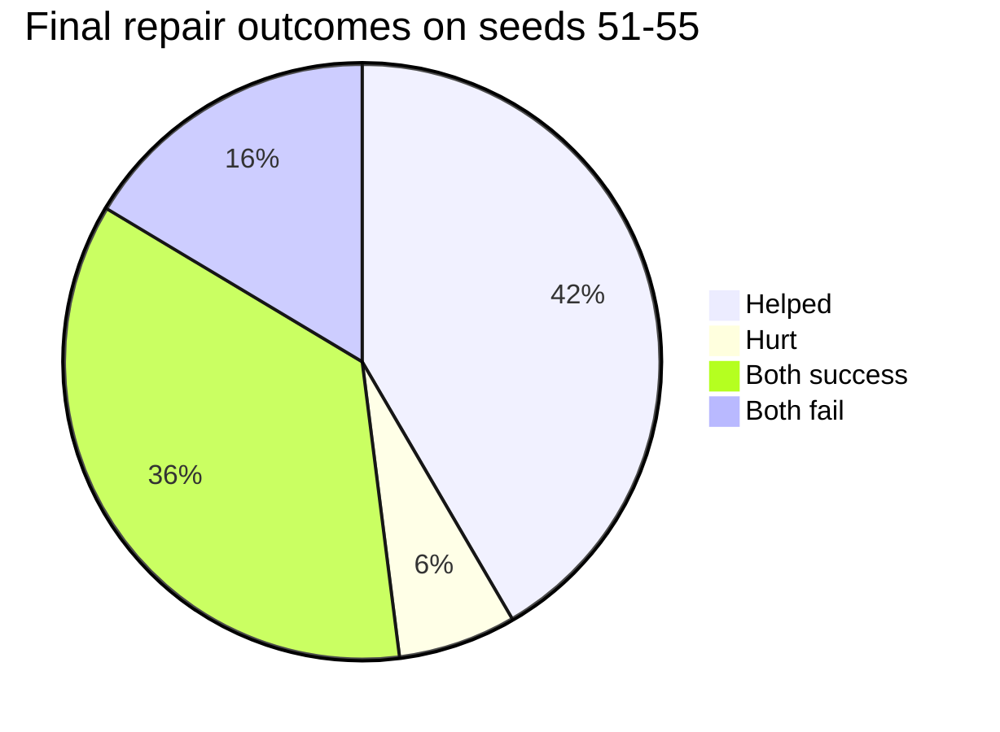

# Paper Figure Specs

## Figure 1: VCSR Pipeline

```mermaid
flowchart LR
  A["Natural-language task"] --> B["Generate K PDDL candidates"]
  B --> C["Parse candidates"]
  C --> D["Score parseable candidates with frozen semantic verifier"]
  D --> E["Select verifier-ranked candidate"]
  E --> F["One-step domain-aware repair at K=8"]
  F --> G["Evaluate semantic equivalence"]
```

## Figure 2: Evidence Funnel

```mermaid
flowchart TD
  A["Verifier training and calibration"] --> B["Round 4 frozen verifier"]
  B --> C["Verifier-ranked K=8: 0.4200"]
  C --> D["Planner/search ablation: no reliable gain"]
  D --> E["Domain-aware repair"]
  E --> F["Repair-augmented K=8: 0.7720"]
```

## Figure 3: Repair Help/Hurt Outcomes

```mermaid
pie title Final repair outcomes on seeds 51-55
  "Helped" : 104
  "Hurt" : 16
  "Both success" : 89
  "Both fail" : 41
```
